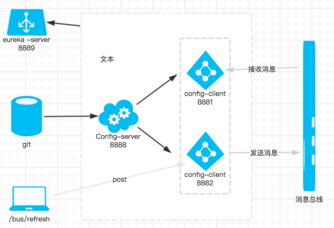

# configure-client-bus

##说明
1、需要多引入spring-cloud-starter-bus-amqp包，增加对消息总线的支持
2、这时我们去代码仓库将foo的值改为“foo version 4”，即改变配置文件foo的值。如果是传统的做法，需要重启服务，才能达到配置文件的更新。此时，我们只需要发送post请求：http://localhost:8881/bus/refresh，你会发现config-client会重新读取配置文件
3、/bus/refresh接口可以指定服务，即使用”destination”参数，比如 “/bus/refresh?destination=customers:**” 即刷新服务名为customers的所有服务，不管ip。

##流程
1、提交代码触发post请求给bus/refresh
2、server端接收到请求并发送给Spring Cloud Bus
3、Spring Cloud bus接到消息并通知给其它客户端
4、其它客户端接收到通知，请求Server端获取最新配置
5、全部客户端均获取到最新的配置

##优化架构
1、在Config Server中也引入Spring Cloud Bus，将配置服务端也加入到消息总线中来。
2、/bus/refresh请求不在发送到具体服务实例上，而是发送给Config Server，并通过destination参数来指定需要更新配置的服务或实例。

总之：我们的服务实例就不需要再承担触发配置更新的职责。同时，对于Git的触发等配置都只需要针对Config Server即可，从而简化了集群上的一些维护工作。

## 框架图
### 获取框架图
